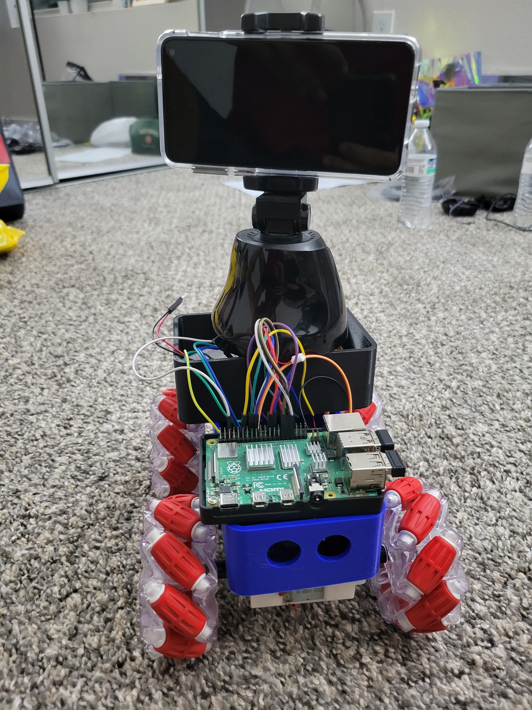
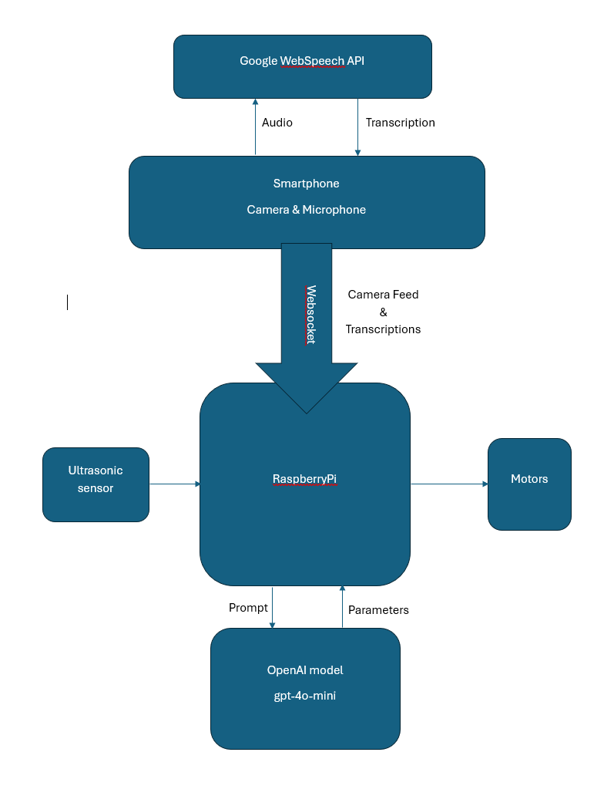
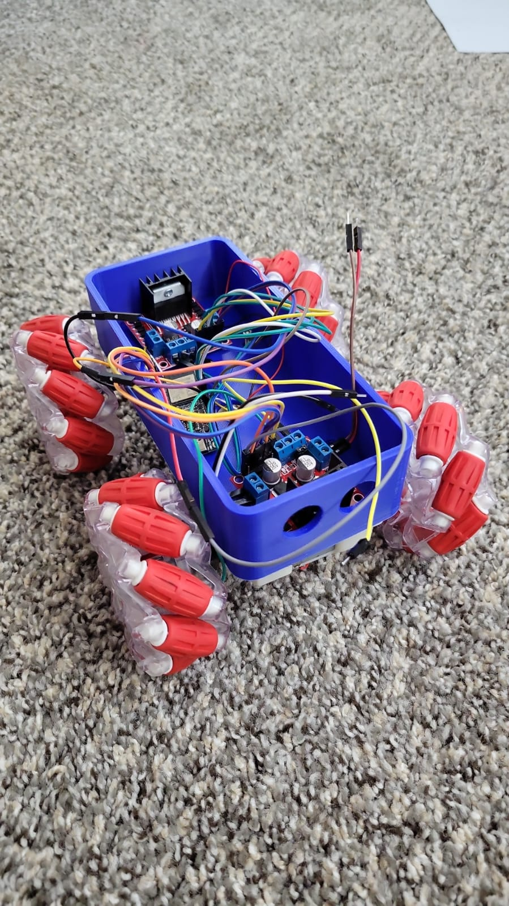
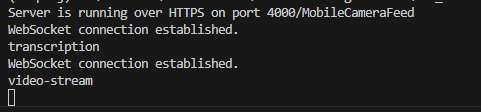
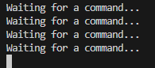
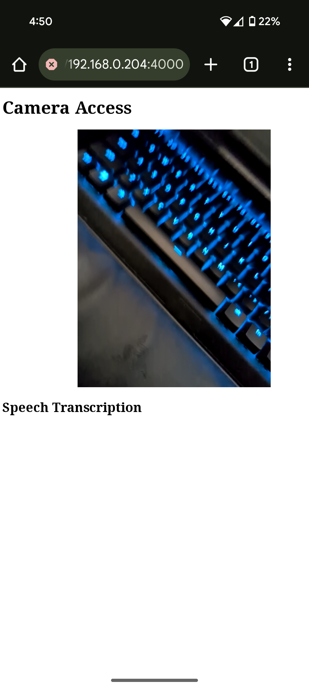

# AME598: Final Project - Desk Companion Bot



### Table of Contents
1. [Project Description](#project-description)
2. [Group Members](#group-members)
3. [Overview](#overview)
4. [Installation Instructions](#installation-instructions)
5. [Usage Instructions](#usage-instructions)

## Project Description
The aim of this project is to create a small robot that can navigate around a  desk or a room and act as a companion. The robot is equiped with camera, microphone, and ultrasonic sensors that are interfaced with onmidirectional (mecanum) wheels through a RaspberryPi.

## Group Members
[Shantanu Patne](https://github.com/sapatne)  
[Vedant Choudhary](https://github.com/VedantC2307)

## Overview
The robot can listen to commands, view its surroundings and navigate as required. For the purpose of this project, an Android phone is used as the camera and microphone. 

### Software
<p align="center">
    
</p>

- The camera and microphone are accessed via web browser, where the commands are transcribed using the `webkitSpeechRecognition` API. It is connected to the RaspberryPi using Websockets. 
 
- The RaspberryPi contains a server that is used for the Websocket communication. The recieved command and video feed are forwarded to a Python script. The script calls the OpenAI API for the `gpt-4o-mini` model using the transcribed prompt and image feed. 

- The GPT model acts as an assistant and has been given clear instructions on how to respond. The GPT response is then used to maneuver the robot.

### Hardware
<p align="center">

</p>
  
- The hardware of the robot consists of wheels, chasis, motors, motor drivers, ultrasonic sensors, RaspberryPi, and batteries.

- The 3D printed chasis has been designed to support the weight of the phone and all other components. The Omnidirectional wheels make it easier for the robot to navigate the environment with minimal body rotations. 

- There are two motor drivers ([LB298N](https://www.makerfabs.com/l298n-motor-driver-board.html)), each supporting one set of motors. The RaspberryPi connects to the drivers and sends the necessary instructions for navigation. The Ultrasonic sensor is interfaced directly with the RaspberryPi for distance calculations, and possible obstacle detection and avoidance.


## Installation Instructions

- Install nodejs
```
sudo apt install nodejs npm
```
- Install the npm packages:
```
npm i
```
- Install python packages by creating a virtual environment:
```
sudo apt install python3-pip python3-venv
python3 -m venv env_name
source ./env_name/bin/activate
pip install -e requirements.txt
```

## Usage Instructions

- Connect the RaspberryPi to WiFi. Note its public IP address.
- In the `public/camera.js` and `public/speech.js` scripts, change the ip address to the one you noted. 
- The server runs on `PORT 4000` so make sure the two files are pointing to this port.
- In the `llm_robot.py` file, make the same change.

> The `camera.js` script reads the camera info and sends it through websocket over path `/video-stream`.  
> The `speech.js` script listens for the microphone instructions, transcribes the speech, and sends the text over the websocket path : `/transcription`.  
> The webserver (`server.js`) listens to these paths and passes the info to other clients (`llm_robot.py`).

- Start the node server and the python script by running the two commands separately. *Make sure to activate the virtual environment beforehand*.
```
node server.js
python3 llm_robot.py
```

This should look like:  
  
for the webserver, and like:  
  
for the python script.
- This should have the main server up and running. On the smartphone, navigate to the ip address you noted before.
` https://<your_ip>:4000/MobileCameraFeed`. You should see your mobile camera feed on the screen.
<p align="center">

</p>

- You can now start interacting with the robot. When giving instructions, start with "Robot" as the wake word. For e.g. "Hey *Robot*, can you see my keys?"

## Statement of Need


## Demo

